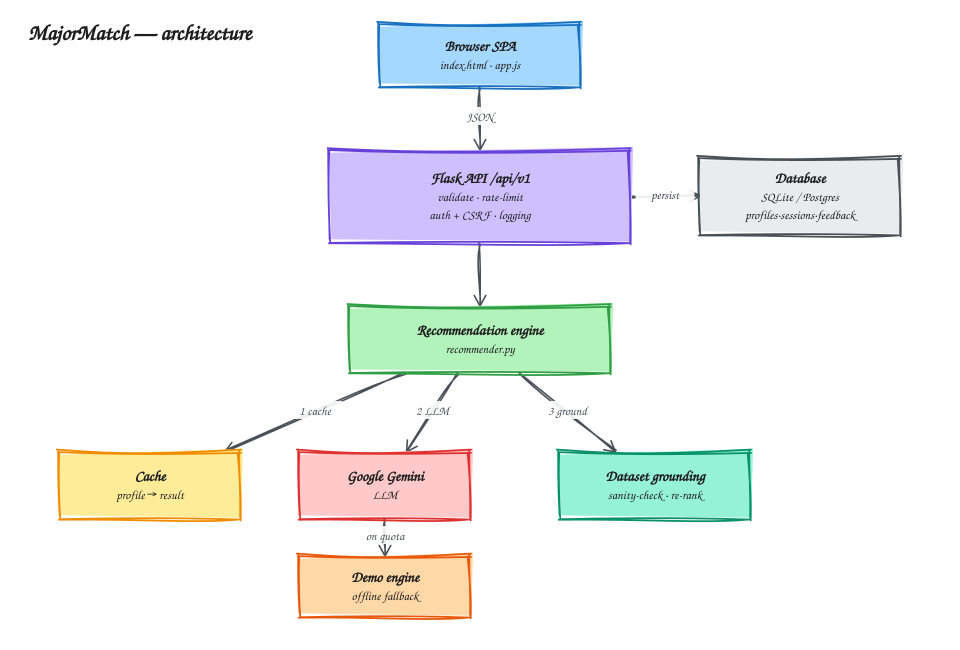

# AI-MajorRecommendation

[](https://github.com/thany-8/AI-MajorRecommendation/actions/workflows/ci.yml)


**MajorMatch** recommends the university majors a student is most likely to enjoy.
Describe your interests, hobbies and strengths, get instant AI-powered matches,
then refine them through a short chat with an AI advisor. Powered by the Google
Gemini API (free tier).

🔗 **Live:** <https://ai-majorrecommendation.onrender.com/>


## Features

- 🧠 **AI recommendations** scored from your interests, hobbies and strengths, refined by follow-up questions.
- 📊 **Grounded in real data** — matches are sanity-checked and re-ranked against a U.S. Census / FiveThirtyEight majors dataset, and each card shows real median earnings and employment rate.
- 🔐 **Accounts** — optional email/password sign-up so history syncs across devices (guest history is adopted on sign-up); CSRF-protected writes.
- ⚡ **Production-minded** — versioned JSON API with Swagger docs, request caching, per-user rate limiting, structured logging and a `/healthz` probe.
- 💾 **Persistence** — profiles, sessions and feedback in SQLite (default) or PostgreSQL.

## Quick start

```bash
git clone https://github.com/thany-8/AI-MajorRecommendation.git
cd AI-MajorRecommendation
python3 -m venv .venv && source .venv/bin/activate   # Windows: .venv\Scripts\activate
pip install -r requirements.txt
cp .env.example .env                                 # then set GEMINI_API_KEY=...
python app.py
```

Open <http://127.0.0.1:5000>.

**No API key?** Run offline demo mode (realistic canned results, no API calls):

```bash
DEMO_MODE=1 python app.py
```

## Architecture



The browser talks only to the versioned JSON API. Each request is validated,
rate-limited and logged, then handled by the recommendation engine, which checks
the **cache**, calls **Gemini** (falling back to the **offline demo engine** on
quota errors), and **grounds/re-ranks** the result against the majors dataset.
Profiles, sessions and feedback are persisted.

> Editable source: [`docs/architecture.excalidraw`](docs/architecture.excalidraw) (open at [excalidraw.com](https://excalidraw.com)).

## API

Versioned JSON API under `/api/v1`, documented with **Swagger UI** at
`/api/docs/swagger` (spec at `/api/docs/openapi.json`).

| Method & path | Description |
| --- | --- |
| `POST /api/v1/start` | Start a session from the profile form. |
| `POST /api/v1/chat` | Refine the recommendation with an answer. |
| `POST /api/v1/feedback` | Record "was this major helpful?" feedback. |
| `GET  /api/v1/history` | List the current user's past sessions. |
| `POST /api/v1/auth/register` · `login` · `logout` | Accounts (adopts guest history). |
| `GET  /api/v1/auth/me` | Current auth state + CSRF token. |

Requests are validated with Pydantic (malformed → **422** `{error, details}`).
State-changing requests require a double-submit CSRF token in the `X-CSRFToken`
header (the SPA handles this automatically).

## Configuration

Set these in `.env` (see [`.env.example`](.env.example) for the full list,
including caching, rate-limit, logging, CSRF and Sentry options):

| Variable | Default | Description |
| --- | --- | --- |
| `GEMINI_API_KEY` | – | Gemini API key (not needed in demo mode). |
| `DEMO_MODE` | `0` | `1` runs free offline demo mode. |
| `DATABASE_URL` | SQLite file | Persistence target; e.g. a `postgresql://…` URL. |
| `FLASK_SECRET_KEY` | dev fallback | Secret used to sign session cookies. |

## Tests & linting

```bash
pip install -r requirements-dev.txt
pytest              # mocked Gemini — runs fully offline
ruff check .        # lint
```

CI (`.github/workflows/ci.yml`) runs ruff + pytest on every push and PR.

## Data & attribution

Grounding data lives in `data/majors.json`, rebuilt with
`python scripts/build_major_dataset.py`. Source:
[FiveThirtyEight "College Majors"](https://github.com/fivethirtyeight/data/tree/master/college-majors),
derived from the U.S. Census ACS PUMS (public domain; FiveThirtyEight's
compilation is CC BY 4.0).

## Design notes

- **Flask** keeps the small footprint tiny; `flask-openapi3` adds FastAPI-style
  Pydantic validation + Swagger without a rewrite.
- **Capacity-only fallback:** a `CapacityError` (quota/rate limit) degrades to a
  deterministic demo engine; those results are labelled and never cached.
- **Grounding** on a real dataset catches hallucinated majors and adds concrete
  numbers; the re-rank is gentle so personality-fit stays primary.
- **Session auth + double-submit CSRF** reuse the existing signed cookies;
  passwords hashed with Werkzeug PBKDF2 (no extra dependency).

## Roadmap

- Move cache / rate-limit / session state to **Redis** for multi-worker deploys.
- Embeddings-based semantic cache for genuinely *similar* profiles.
- Richer grounding (O*NET interest-fit, College Scorecard, earnings ranges).
- Account polish: OAuth, email verification, password reset.

> Recommendations are guidance to explore, not a guarantee.
