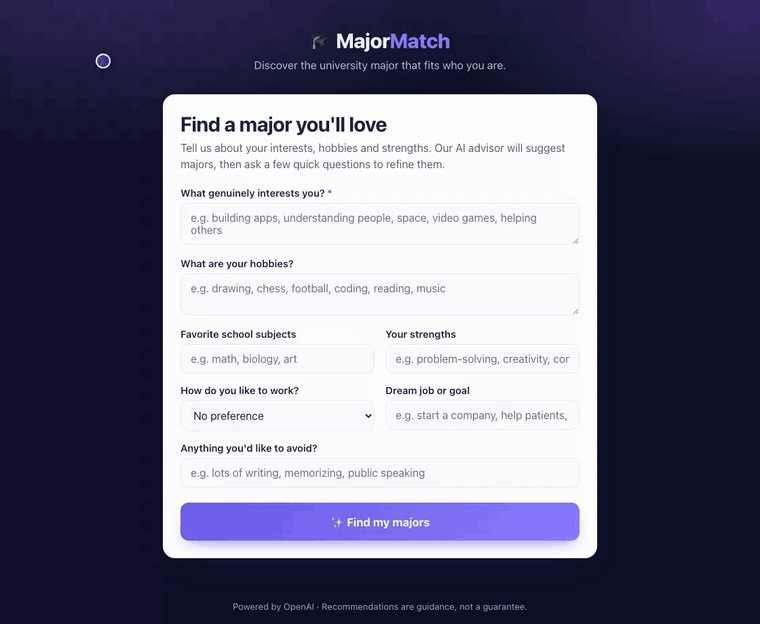

# AI-MajorRecommendation

**MajorMatch** is a web app that recommends the university majors a student is
most likely to enjoy and thrive in. Students describe their interests, hobbies
and strengths, get instant AI-powered major matches, and then refine the results
through a short chat-style Q&A with an AI advisor.

Powered by the OpenAI API.

## Demo



*A student describes their interests and hobbies, gets ranked major matches with
fit percentages, then refines the results by answering a few follow-up questions
from the AI advisor.*

## Features

- 🎨 **Visual web interface** – a profile form, ranked major cards with match
  percentages, an animated trait profile, and a refine-by-chat panel.
- 🧠 **AI recommendations** – majors are scored from the student's interests,
  hobbies, favourite subjects and strengths (not limited to a fixed list).
- 💬 **Refine with follow-up questions** – the advisor asks a few targeted
  questions and updates the recommendations live.

## Requirements

- Python 3.10+
- An [OpenAI API key](https://platform.openai.com/api-keys)

## Setup

```bash
# 1. Clone and enter the project
git clone https://github.com/thany-8/AI-MajorRecommendation.git
cd AI-MajorRecommendation

# 2. Create and activate a virtual environment
python3 -m venv .venv
source .venv/bin/activate        # Windows: .venv\Scripts\activate

# 3. Install dependencies
pip install -r requirements.txt

# 4. Add your OpenAI API key
cp .env.example .env
# then open .env and set OPENAI_API_KEY=sk-...
```

## Run the web app

```bash
python app.py
```

Then open <http://127.0.0.1:5000> in your browser.

## Configuration

Set these in your `.env` file (see `.env.example`):

| Variable            | Required | Default        | Description                              |
| ------------------- | -------- | -------------- | ---------------------------------------- |
| `OPENAI_API_KEY`    | yes      | –              | Your OpenAI API key.                     |
| `OPENAI_MODEL`      | no       | `gpt-4o-mini`  | Chat model used for recommendations.     |
| `FLASK_SECRET_KEY`  | no       | dev fallback   | Secret used to sign session cookies.     |

## Project structure

```
AI-MajorRecommendation/
├── app.py                     # Flask web server (routes + session state)
├── requirements.txt
├── .env.example
├── templates/
│   └── index.html             # Single-page UI
├── static/
│   ├── css/style.css
│   └── js/app.js
└── src/
    ├── recommender.py         # Recommendation engine: one JSON call per turn
    └── utils.py               # OpenAI client + shared config
```

## How it works

1. The student submits the profile form → `POST /api/start`.
2. `recommender.start_session()` sends the profile to OpenAI and gets back trait
   scores, ranked major recommendations, a friendly message and a follow-up
   question — all as strict JSON.
3. Each answer → `POST /api/chat` → `recommender.refine_session()` updates the
   scores and recommendations until the advisor has enough information.

> Recommendations are guidance to explore, not a guarantee.
